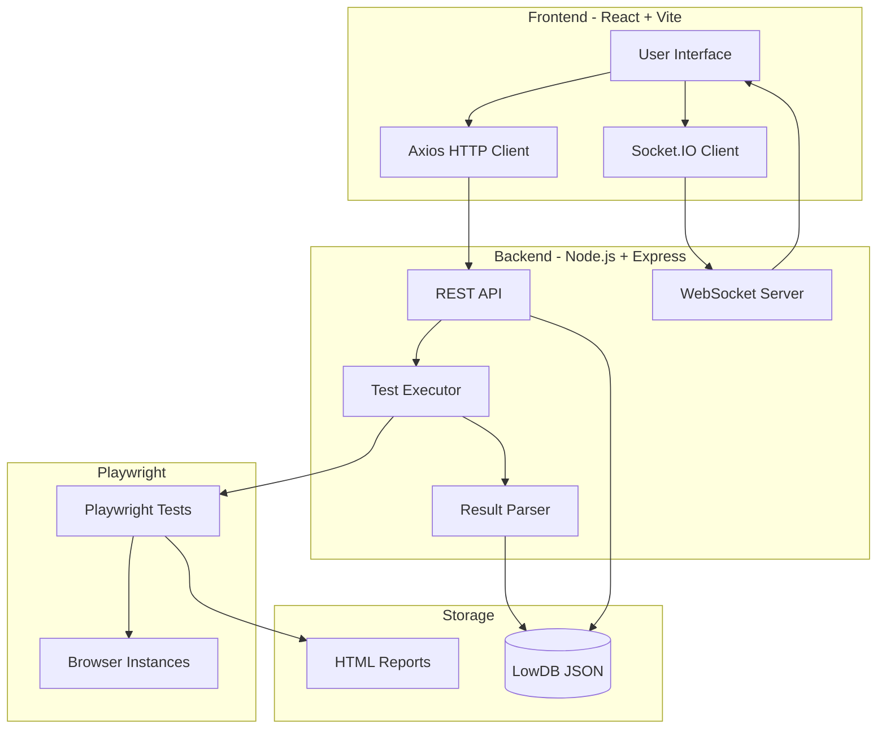
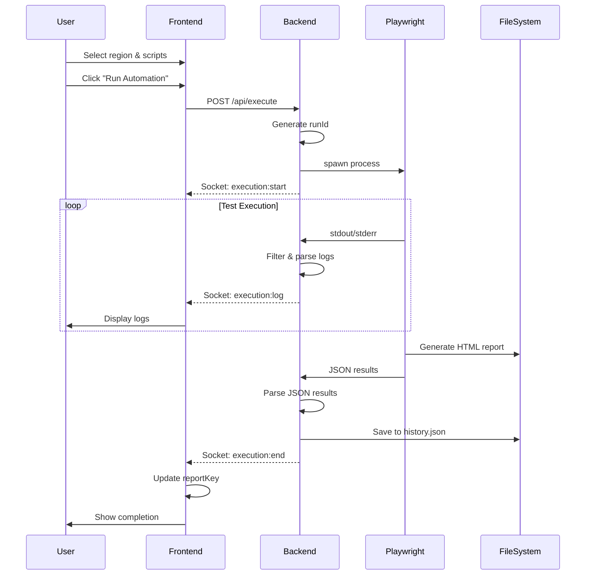

# Automation Dashboard - Complete Documentation

## Table of Contents
1. [Overview](#overview)
2. [Architecture](#architecture)
3. [Technology Stack](#technology-stack)
4. [Application Flow](#application-flow)
5. [Backend Details](#backend-details)
6. [Frontend Details](#frontend-details)
7. [Database](#database)
8. [API Endpoints](#api-endpoints)
9. [WebSocket Events](#websocket-events)
10. [Deployment Guide](#deployment-guide)

---

## Overview

The Automation Dashboard is a web-based interface for managing and executing Playwright automation tests. It provides real-time test execution monitoring, detailed statistics, execution history, and HTML report viewing.

**Key Features:**
- 🚀 Execute Playwright tests from web interface
- 📊 Real-time execution logs via WebSocket
- 📈 Detailed test statistics and metrics
- 📜 Execution history with filtering
- 📄 Integrated Playwright HTML reports
- 🛑 Stop running executions
- 🔄 Rerun previous executions
- 📱 Responsive design (mobile-friendly)

---

## Architecture



---

## Technology Stack

### Backend
- **Runtime**: Node.js v22.16.0
- **Framework**: Express.js
- **WebSocket**: Socket.IO
- **Database**: LowDB (JSON file-based)
- **Process Management**: Node.js `child_process`
- **CORS**: cors middleware

### Frontend
- **Framework**: React 18
- **Build Tool**: Vite
- **HTTP Client**: Axios
- **WebSocket**: Socket.IO Client
- **Charts**: Recharts
- **Icons**: Lucide React
- **Styling**: Tailwind CSS (utility classes)

### Testing
- **Framework**: Playwright
- **Reporters**: List, JSON, HTML
- **Browsers**: Chromium, Firefox, WebKit

---

## Application Flow

### 1. Test Execution Flow



### 2. Data Flow

```
User Input → Frontend State → API Request → Backend Processing → 
Playwright Execution → Result Parsing → Database Storage → 
WebSocket Broadcast → Frontend Update → UI Refresh
```

---

## Backend Details

### File Structure
```
server/
├── server.js           # Main server file
├── db.json            # LowDB database file
└── package.json       # Dependencies
```

### Key Components

#### 1. Express Server
```javascript
const app = express();
const server = http.createServer(app);
const io = socketIo(server, { cors: { origin: '*' } });
```

#### 2. Database (LowDB)
```javascript
const adapter = new JSONFile('db.json');
const db = new Low(adapter);
await db.read();
db.data = db.data || { history: [] };
```

**Schema:**
```json
{
  "history": [
    {
      "runId": "1732781234567",
      "timestamp": "2025-11-28T06:30:34.567Z",
      "region": "ZA",
      "scripts": ["betslip", "header"],
      "status": "Passed",
      "duration": 45000,
      "triggeredBy": "User",
      "config": { "region": "ZA", "scripts": [...], "env": {} },
      "perScriptResults": [
        {
          "scriptName": "betslip",
          "passed": 2,
          "failed": 0,
          "totalTests": 2,
          "duration": 22600,
          "testCases": [
            {
              "title": "T1-Verify Betslip Section",
              "status": "passed",
              "duration": 22600
            }
          ]
        }
      ],
      "totalTests": 2,
      "totalPassed": 2,
      "totalFailed": 0,
      "successRate": 100
    }
  ]
}
```

#### 3. Test Executor

**Command Construction:**
```javascript
const args = [
    'playwright',
    'test',
    'src/regions/ZA/tests/modules/betslip/betslip.spec.ts',
    '--config=playwright.ZA.config.ts',
    '--headed',
    '--reporter=list,json,html'
];
```

**Process Spawning:**
```javascript
const child = spawn('npx', args, {
    cwd: AUTOMATION_DIR,
    env: { ...process.env, ...env, REGION: region },
    shell: true
});
```

#### 4. Result Parser

**JSON Parsing Function:**
```javascript
function parsePlaywrightJSON(jsonReport, scripts) {
    // Navigates Playwright's JSON structure
    // Extracts test cases, status, duration
    // Returns per-script results with test details
}
```

**Fallback Regex Parser:**
```javascript
function parsePlaywrightResults(output, scripts) {
    // Regex-based parsing for fallback
    // Extracts basic pass/fail counts
}
```

#### 5. Process Management

**Stop Execution:**
```javascript
// Windows: Kill process tree
exec(`taskkill /pid ${pid} /T /F`);

// Unix: Send SIGKILL
child.kill('SIGKILL');
```

---

## Frontend Details

### File Structure
```
client2/
├── src/
│   ├── App.jsx         # Main application component
│   └── index.css       # Global styles
├── dist/               # Production build
├── package.json        # Dependencies
└── vite.config.js      # Vite configuration
```

### State Management

**Main State Variables:**
```javascript
const [activeTab, setActiveTab] = useState('dashboard');
const [selectedRegions, setSelectedRegions] = useState(['ZA']);
const [selectedScripts, setSelectedScripts] = useState([]);
const [isRunning, setIsRunning] = useState(false);
const [logs, setLogs] = useState([]);
const [history, setHistory] = useState([]);
const [currentRunId, setCurrentRunId] = useState(null);
const [latestRun, setLatestRun] = useState(null);
const [reportKey, setReportKey] = useState(Date.now());
const [isMobileMenuOpen, setIsMobileMenuOpen] = useState(false);
```

### Component Structure

```
App
├── Sidebar
│   ├── Logo & Title
│   ├── Navigation (Dashboard, Statistics, History, Reports)
│   └── Status Indicator
│
├── Main Content Area
│   ├── DashboardView
│   │   ├── Region Selector
│   │   ├── Script Selector
│   │   ├── Run/Stop Buttons
│   │   └── Logs Panel
│   │
│   ├── StatisticsView
│   │   ├── Stats Cards
│   │   ├── Charts (Bar, Pie, Line)
│   │   └── Script Details Table
│   │
│   ├── HistoryView
│   │   ├── Filter Dropdown
│   │   └── History Table
│   │
│   └── ReportsView
│       └── Playwright HTML Report (iframe)
```

### WebSocket Integration

```javascript
useEffect(() => {
    const socket = io('http://localhost:3000');
    
    socket.on('execution:start', (data) => {
        setIsRunning(true);
        setCurrentRunId(data.runId);
    });
    
    socket.on('execution:log', (data) => {
        setLogs(prev => [...prev, data]);
    });
    
    socket.on('execution:end', (data) => {
        setIsRunning(false);
        fetchHistory();
        setReportKey(Date.now()); // Refresh report
    });
    
    return () => socket.disconnect();
}, []);
```

### Responsive Design

**Breakpoints:**
- Mobile: `< 768px` (md)
- Tablet: `768px - 1024px` (lg)
- Desktop: `> 1024px`

**Key Responsive Features:**
- Mobile menu toggle
- Flexible grid layouts
- Stacked components on mobile
- Touch-friendly buttons
- Scrollable tables

---

## Database

### Technology: LowDB

LowDB is a simple JSON file-based database perfect for small applications.

**Location:** `server/db.json`

**Operations:**

```javascript
// Read
await db.read();
const history = db.data.history;

// Write
db.data.history.push(newEntry);
await db.write();

// Query
const latestRun = db.data.history
    .sort((a, b) => b.timestamp - a.timestamp)[0];
```

**Advantages:**
- No setup required
- Human-readable JSON
- Version control friendly
- Perfect for development

**Limitations:**
- Not suitable for large datasets
- No concurrent write protection
- Limited query capabilities

---

## API Endpoints

### 1. Execute Tests
**Endpoint:** `POST /api/execute`

**Request Body:**
```json
{
  "region": "ZA",
  "scripts": ["betslip", "header"],
  "env": {
    "USERNAME": "test@example.com",
    "PASSWORD": "password123"
  }
}
```

**Response:**
```json
{
  "success": true,
  "runId": "1732781234567",
  "message": "Execution started"
}
```

### 2. Stop Execution
**Endpoint:** `POST /api/stop`

**Response:**
```json
{
  "success": true,
  "message": "Execution stopped",
  "runId": "1732781234567"
}
```

### 3. Get History
**Endpoint:** `GET /api/history`

**Response:**
```json
[
  {
    "runId": "1732781234567",
    "timestamp": "2025-11-28T06:30:34.567Z",
    "region": "ZA",
    "scripts": ["betslip"],
    "status": "Passed",
    "duration": 45000,
    "totalTests": 2,
    "totalPassed": 2,
    "totalFailed": 0,
    "successRate": 100
  }
]
```

### 4. Get Latest Run
**Endpoint:** `GET /api/latest-run`

**Response:** Same as single history entry

### 5. Rerun Execution
**Endpoint:** `POST /api/rerun/:runId`

**Response:**
```json
{
  "success": true,
  "newRunId": "1732781345678",
  "message": "Rerun started"
}
```

### 6. Static Files
**Endpoint:** `GET /report/*`
- Serves Playwright HTML reports from `playwright-report/`

**Endpoint:** `GET /*`
- Serves React frontend from `client2/dist/`

---

## WebSocket Events

### Server → Client

#### 1. execution:start
```javascript
{
  runId: "1732781234567",
  region: "ZA",
  scripts: ["betslip"]
}
```

#### 2. execution:log
```javascript
{
  runId: "1732781234567",
  type: "stdout", // or "stderr"
  data: "  ✓ T1-Verify Betslip Section (22.6s)"
}
```

#### 3. execution:end
```javascript
{
  runId: "1732781234567",
  status: "Passed",
  code: 0,
  results: { /* full history entry */ }
}
```

#### 4. execution:stopped
```javascript
{
  runId: "1732781234567",
  message: "Execution stopped by user"
}
```

---

## Deployment Guide

### Development Setup

1. **Install Dependencies:**
```bash
# Backend
cd server
npm install

# Frontend
cd client2
npm install
```

2. **Start Backend:**
```bash
cd server
npm start
# Runs on http://0.0.0.0:3000
```

3. **Start Frontend:**
```bash
cd client2
npm run dev
# Runs on http://localhost:5173
```

### Production Deployment

1. **Build Frontend:**
```bash
cd client2
npm run build
# Creates optimized build in dist/
```

2. **Start Backend:**
```bash
cd server
npm start
# Serves both API and frontend on port 3000
```

3. **Access Application:**
```
http://YOUR_IP:3000
```

### Network Access

**Allow Firewall (Windows):**
```powershell
netsh advfirewall firewall add rule name="Betway Dashboard" dir=in action=allow protocol=TCP localport=3000
```

**Find Your IP:**
```powershell
ipconfig | findstr /i "IPv4"
```

**Share URL:**
```
http://YOUR_IP:3000
```

### Environment Variables

**Backend (.env):**
```
PORT=3000
AUTOMATION_DIR=C:/Users/SW115406/Desktop/Betway/Betway-Automation
```

**Frontend (vite.config.js):**
```javascript
server: {
  proxy: {
    '/api': 'http://localhost:3000',
    '/socket.io': { target: 'http://localhost:3000', ws: true },
    '/report': 'http://localhost:3000'
  }
}
```

---

## Configuration Files

### Playwright Config
**File:** `Betway-Automation/playwright.ZA.config.ts`

```typescript
export default defineConfig({
  testDir: './src/regions/ZA/tests',
  timeout: 200000,
  workers: 1,
  reporter: [
    ['html', { outputFolder: 'playwright-report', open: 'never' }],
    ['list']
  ],
  use: {
    baseURL: 'https://new.betway.co.za/',
    viewport: null,
    launchOptions: { args: ['--start-maximized'] },
    screenshot: 'only-on-failure'
  }
});
```

### Package.json Scripts

**Backend:**
```json
{
  "scripts": {
    "start": "node server.js"
  }
}
```

**Frontend:**
```json
{
  "scripts": {
    "dev": "vite",
    "build": "vite build",
    "preview": "vite preview"
  }
}
```

---

## Troubleshooting

### Common Issues

**1. Reports not updating:**
- Ensure `--reporter=list,json,html` is in command
- Check `playwright-report/` directory exists
- Verify `reportKey` updates on execution:end

**2. WebSocket connection failed:**
- Check backend is running on port 3000
- Verify CORS settings allow frontend origin
- Check firewall allows port 3000

**3. Tests not stopping:**
- Windows: Uses `taskkill /T /F` for process tree
- Unix: Uses `SIGKILL`
- Check `currentExecution` is tracked correctly

**4. Statistics showing wrong data:**
- Verify JSON reporter is enabled
- Check `parsePlaywrightJSON()` function
- Ensure test results are in correct format

---

## Future Enhancements

- [ ] User authentication
- [ ] Scheduled test runs
- [ ] Email notifications
- [ ] Test result comparison
- [ ] Multi-region parallel execution
- [ ] Database migration to PostgreSQL
- [ ] Docker containerization
- [ ] CI/CD integration

---

## Support & Maintenance

**Logs Location:**
- Backend: Console output
- Frontend: Browser DevTools Console
- Playwright: `playwright-report/`

**Database Backup:**
```bash
cp server/db.json server/db.backup.json
```

**Clear History:**
```javascript
// In server.js
db.data.history = [];
await db.write();
```

---

*Documentation Version: 1.0*  
*Last Updated: 2025-11-28*
